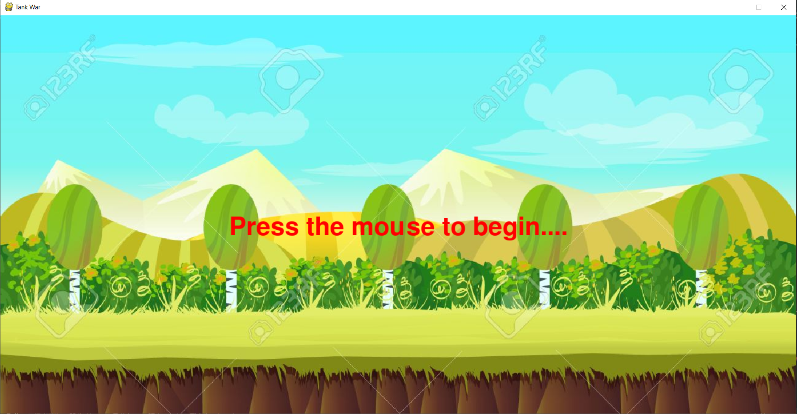
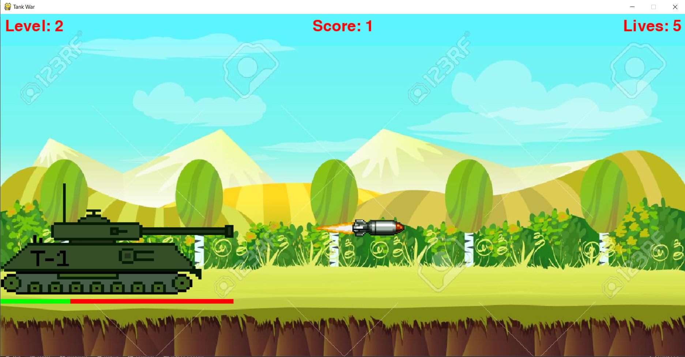
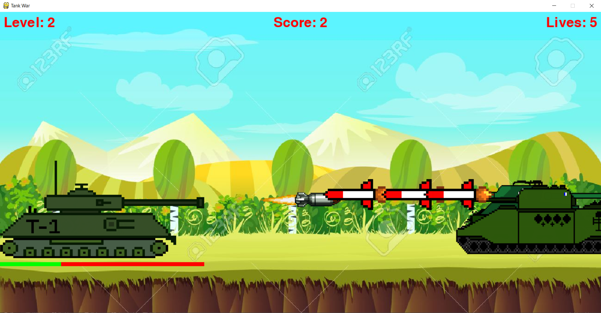
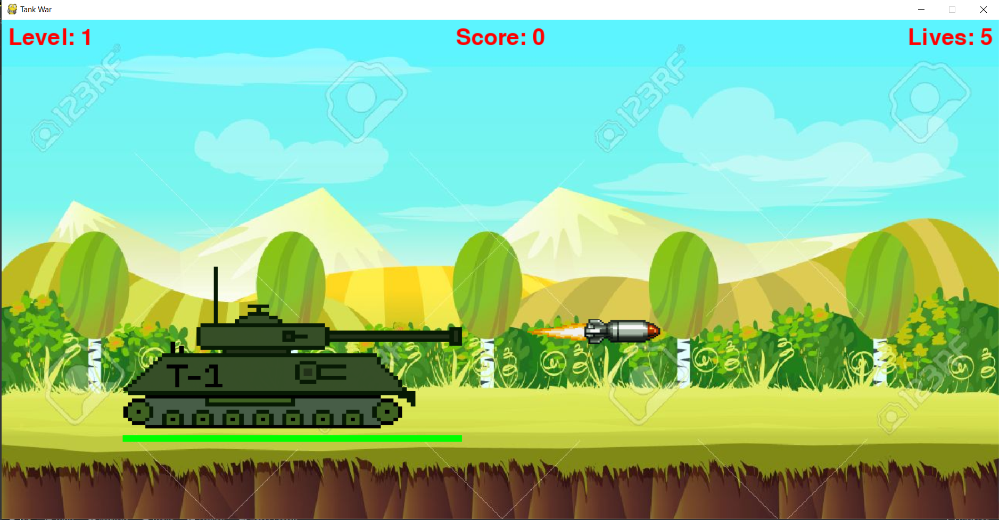
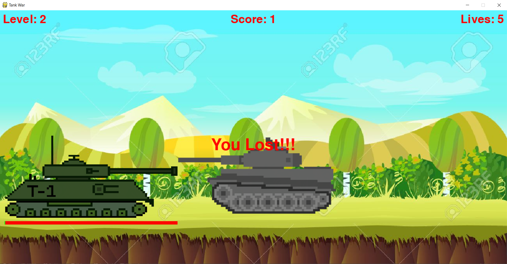

# Tank-War
Tank War is a 2D game made using Python-Pygame module

## About
Tank War is a two-dimensional fixed shooter game in which the player controls a tank with missiles by moving it horizontally across the bottom of the screen and firing at incoming enemy tanks. The aim is to defeat five rows of enemy tanks that move horizontally towards the player tank shooting missiles. The player defeat an enemy tank by shooting it with the missile. The enemy tanks attempt to destroy the player ship by firing at it while they approach the end of the screen. If they reach the end of the screen, the enemy tank invasion is successful and the player tank life decreases and eventually if player tank life becomes zero the game ends but if the players tank is able to defeat5 rows of enemy tanks then he/she wins

The 2d-game has a acrade feel with upbeat background music and missile sounds at the time of firing 


## How To Play

- If you have the correct version of Python and Pygame installed, you can run the program in the command prompt / terminal.

```bash

python main.py
```

**Note:** If you're using Python 3, replace the command "python" with "python3.8.3"


## Tank War Game Screenshots








